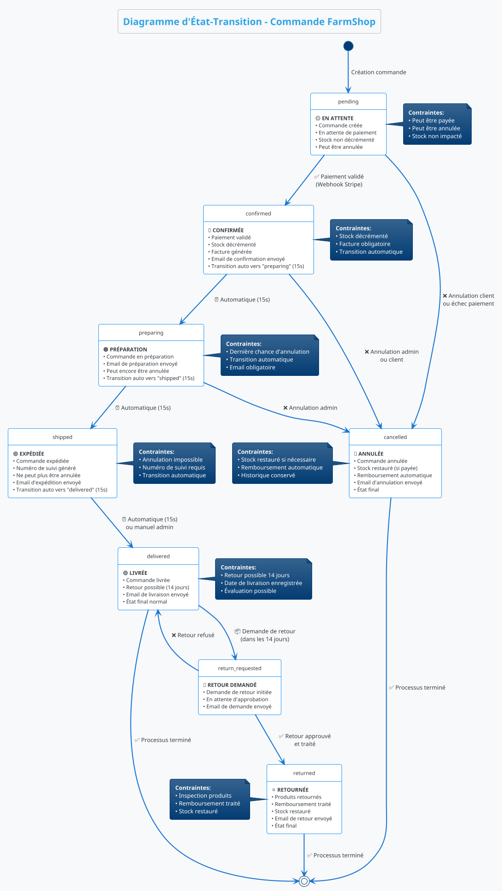
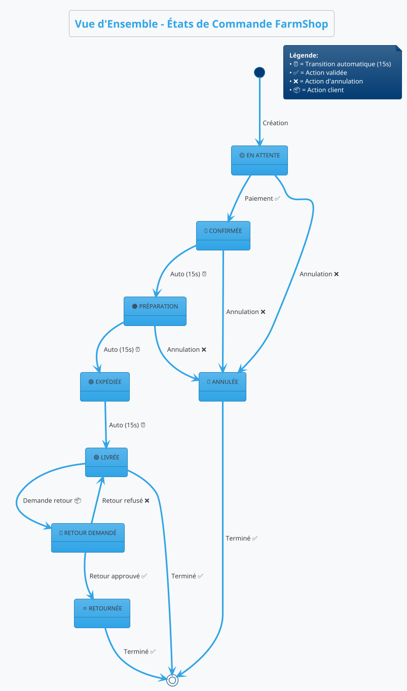

# Diagrammes UML - Processus d'Achat FarmShop

## 1. Diagramme d'Activité - Processus d'Achat Complet

```plantuml
@startuml ProcessusAchatActivite
!theme cerulean
skinparam backgroundColor #F8F9FA
skinparam activityDiamondBackgroundColor #E3F2FD
skinparam activityBackgroundColor #FFFFFF
skinparam activityBorderColor #2196F3

title **Diagramme d'Activité - Processus d'Achat FarmShop**

|#LightBlue|Client|
start
:Naviguer sur le site;
:Parcourir les produits;
:Sélectionner un produit;

if (Produit disponible ?) then (oui)
    :Ajouter au panier;
    note right: Vérification du stock
else (non)
    :Afficher "Rupture de stock";
    stop
endif

:Consulter le panier;

if (Continuer les achats ?) then (oui)
    :Parcourir d'autres produits;
    note left: Boucle possible
else (non)
    :Procéder au checkout;
endif

|#LightGreen|Système|
:Vérifier la disponibilité;
:Calculer le total;
:Appliquer les offres spéciales;

|#LightBlue|Client|
:Remplir informations de livraison;
:Choisir mode de paiement;
:Confirmer la commande;

|#LightGreen|Système|
:Créer la commande (statut: pending);
:Générer numéro de commande;
:Rediriger vers paiement Stripe;

|#LightOrange|Stripe|
:Traitement du paiement;

if (Paiement réussi ?) then (oui)
    |#LightGreen|Système|
    :Webhook reçu;
    :Marquer commande comme payée;
    :Décrémenter le stock;
    :Changer statut vers "confirmed";
    
    |#LightPink|Notifications|
    :Envoyer email confirmation;
    
    |#LightGreen|Système|
    :Générer facture;
    :Programmer transitions automatiques;
    
    fork
        :Attendre 15 secondes;
        :Changer statut vers "preparing";
        
        |#LightPink|Notifications|
        :Envoyer email préparation;
        
        |#LightGreen|Système|
        :Attendre 15 secondes;
        :Changer statut vers "shipped";
        :Générer numéro de suivi;
        
        |#LightPink|Notifications|
        :Envoyer email expédition;
        
        |#LightGreen|Système|
        :Attendre 15 secondes;
        :Changer statut vers "delivered";
        :Activer possibilité de retour;
        
        |#LightPink|Notifications|
        :Envoyer email livraison;
        
    fork again
        |#LightBlue|Client|
        :Suivre la commande;
        :Recevoir notifications;
    end fork
    
else (non)
    |#LightGreen|Système|
    :Marquer paiement échoué;
    :Garder commande en "pending";
    
    |#LightBlue|Client|
    :Retenter le paiement;
    note right: Ou annuler
endif

|#LightYellow|Actions Possibles|
fork
    |#LightBlue|Client|
    if (Commande livrée ?) then (oui)
        :Demander un retour;
        note right: Dans les 14 jours
    endif
fork again
    |#LightBlue|Client|
    if (Avant expédition ?) then (oui)
        :Annuler la commande;
        :Remboursement automatique;
    endif
fork again
    |#LightBlue|Client|
    :Renouveler la commande;
    :Ajouter produits au panier;
end fork

stop

@enduml
```

## 2. Diagramme d'État-Transition - États des Commandes



## 3. Diagramme de Séquence - Interactions Paiement et Confirmation

```plantuml
@startuml SequencePaiementConfirmation
!theme cerulean
skinparam backgroundColor #F8F9FA
skinparam sequence {
    ArrowColor #1976D2
    LifeLineBackgroundColor #E3F2FD
    LifeLineBorderColor #2196F3
    ParticipantBackgroundColor #FFFFFF
    ParticipantBorderColor #2196F3
}

title **Diagramme de Séquence - Paiement et Confirmation d'Achat**

actor "👤 Client" as Client
participant "🌐 FarmShop\nWeb" as Web
participant "🔧 Order\nController" as OrderCtrl
participant "💳 Stripe\nService" as Stripe
participant "📧 Email\nService" as Email
participant "📊 Queue\nSystem" as Queue
database "🗄️ Base de\nDonnées" as DB

== Phase 1: Création de Commande ==

Client -> Web : Valider panier et\nprocéder au checkout
Web -> OrderCtrl : POST /orders\n(données de livraison)

OrderCtrl -> DB : Vérifier disponibilité produits
DB --> OrderCtrl : Stock confirmé

OrderCtrl -> DB : Créer commande\n(status: pending)
DB --> OrderCtrl : Commande créée\n(ID: 123, status: pending)

OrderCtrl -> Stripe : Créer PaymentIntent
Stripe --> OrderCtrl : PaymentIntent\n(client_secret)

OrderCtrl --> Web : Redirection vers\npage de paiement Stripe
Web --> Client : Interface de paiement

== Phase 2: Traitement du Paiement ==

Client -> Stripe : Saisir informations\nde carte bancaire
Stripe -> Stripe : Traitement sécurisé\ndu paiement

alt Paiement Réussi
    Stripe -> Web : Webhook\npayment_intent.succeeded
    Web -> Stripe : Vérifier signature\nwebhook
    
    Web -> OrderCtrl : handleWebhook()
    OrderCtrl -> DB : Mettre à jour commande\n(payment_status: paid)
    OrderCtrl -> DB : Décrémenter stock produits
    
    == Phase 3: Confirmation et Workflow Automatique ==
    
    OrderCtrl -> DB : Changer statut\n(status: confirmed)
    DB --> OrderCtrl : Statut mis à jour
    
    OrderCtrl -> Email : Envoyer email\nde confirmation
    Email --> Client : 📧 "Commande confirmée"
    
    OrderCtrl -> DB : Générer facture\n(invoice_number)
    
    OrderCtrl -> Queue : Programmer transition\nvers "preparing" (15s)
    
    == Workflow Automatique ==
    
    Queue -> OrderCtrl : ProcessOrderStatusJob\n(preparing)
    OrderCtrl -> DB : status = preparing
    OrderCtrl -> Email : Email préparation
    Email --> Client : 📧 "Commande en préparation"
    
    OrderCtrl -> Queue : Programmer transition\nvers "shipped" (15s)
    
    Queue -> OrderCtrl : ProcessOrderStatusJob\n(shipped)
    OrderCtrl -> DB : status = shipped\nshipped_at = now()
    OrderCtrl -> Email : Email expédition\n+ numéro de suivi
    Email --> Client : 📧 "Commande expédiée"
    
    OrderCtrl -> Queue : Programmer transition\nvers "delivered" (15s)
    
    Queue -> OrderCtrl : ProcessOrderStatusJob\n(delivered)
    OrderCtrl -> DB : status = delivered\ndelivered_at = now()
    OrderCtrl -> Email : Email livraison
    Email --> Client : 📧 "Commande livrée"
    
    OrderCtrl --> Client : Processus terminé\nRetour possible 14 jours

else Paiement Échoué
    Stripe -> Web : Webhook\npayment_intent.payment_failed
    Web -> OrderCtrl : handleFailedPayment()
    OrderCtrl -> DB : payment_status = failed
    OrderCtrl -> Email : Email échec paiement
    Email --> Client : 📧 "Échec du paiement"
    OrderCtrl --> Client : Possibilité de retenter
end

== Actions Optionnelles du Client ==

opt Annulation (avant expédition)
    Client -> Web : Demande d'annulation
    Web -> OrderCtrl : PATCH /orders/{id}/cancel
    OrderCtrl -> DB : status = cancelled
    OrderCtrl -> DB : Restaurer stock
    OrderCtrl -> Stripe : Remboursement automatique
    OrderCtrl -> Email : Email annulation
    Email --> Client : 📧 "Commande annulée"
end

opt Demande de Retour (après livraison)
    Client -> Web : Demande de retour
    Web -> OrderCtrl : POST /orders/{id}/return
    OrderCtrl -> DB : status = return_requested
    OrderCtrl -> Email : Email demande retour
    Email --> Client : 📧 "Demande de retour reçue"
end

@enduml
```



## 4. Diagramme d'État-Transition Simplifié - Vue d'Ensemble



---

## Guide d'Utilisation des Diagrammes

### 1. **Diagramme d'Activité**
- **Usage :** Comprendre le flux complet du processus d'achat
- **Acteurs :** Client, Système, Stripe, Notifications
- **Points clés :** Vérifications, validations, actions parallèles

### 2. **Diagramme d'État-Transition**  
- **Usage :** Comprendre les états possibles d'une commande
- **Focus :** Transitions automatiques vs manuelles
- **Contraintes :** Règles métier pour chaque état

### 3. **Diagramme de Séquence**
- **Usage :** Comprendre les interactions entre composants
- **Focus :** Communication temps réel entre services
- **Détails :** Messages, timing, conditions

### 4. **Vue d'Ensemble Simplifiée**
- **Usage :** Référence rapide des états
- **Focus :** Transitions principales uniquement
- **Public :** Stakeholders non-techniques

## Caractéristiques Techniques Importantes

✅ **Transitions Automatiques :** 15 secondes entre chaque étape  
✅ **Gestion des Stocks :** Décrémentation à la confirmation  
✅ **Notifications :** Email à chaque changement d'état  
✅ **Workflows Parallèles :** Jobs en arrière-plan  
✅ **Gestion d'Erreurs :** Rollback et compensation  
✅ **Traçabilité :** Historique complet des transitions
