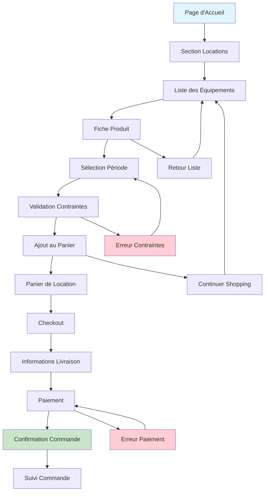
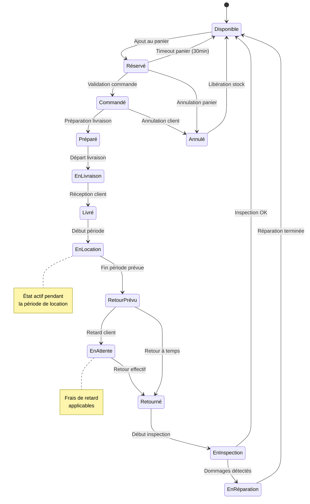
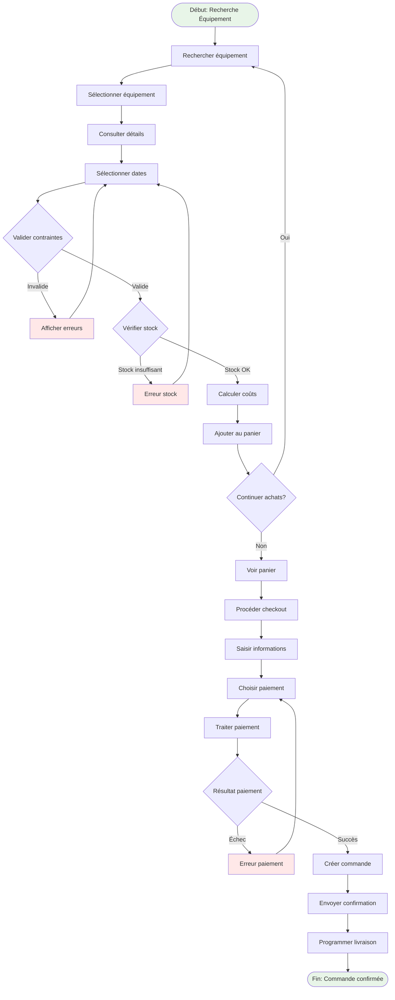
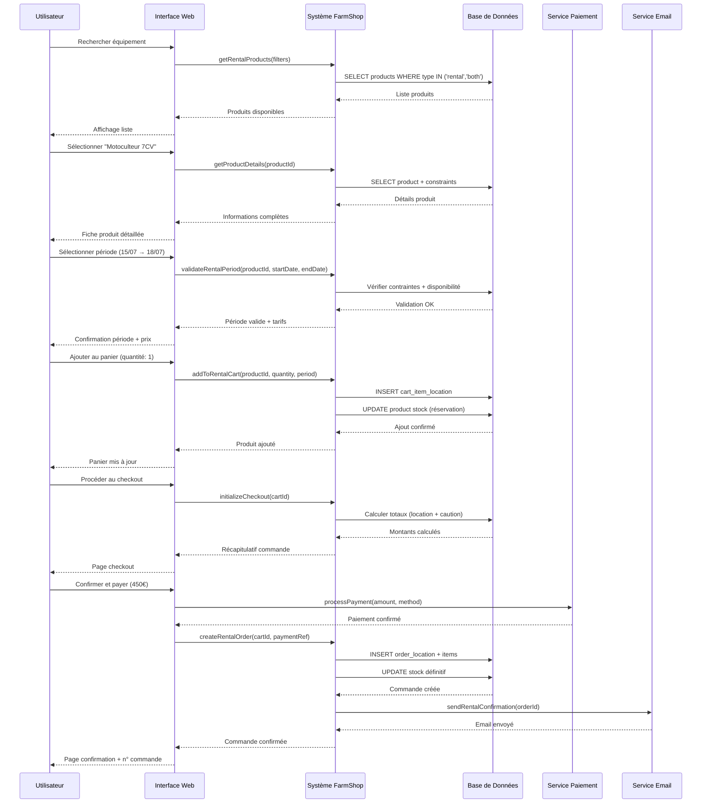

# Rapport d'Analyse UML 2 - Version 3/3
**Projet : FarmShop - Application E-commerce Agricole**  
**Date : 15 juillet 2025**  
**Auteur : Équipe de Développement FarmShop**

---

## Table des Matières

1. [Introduction](#introduction)
2. [Scénario d'Analyse](#scénario-danalyse)
3. [Diagrammes Dynamiques](#diagrammes-dynamiques)
   - 3.1. [Diagramme de Navigation](#diagramme-de-navigation)
   - 3.2. [Diagramme d'État-Transition](#diagramme-détat-transition)
   - 3.3. [Diagramme d'Activité](#diagramme-dactivité)
   - 3.4. [Diagrammes d'Interaction](#diagrammes-dinteraction)
4. [Validation des Scénarios](#validation-des-scénarios)
5. [Design Patterns Adoptés](#design-patterns-adoptés)
6. [Conclusion](#conclusion)

---

## 1. Introduction

Ce rapport présente l'analyse UML 2 de l'application FarmShop, en se concentrant sur la validation des diagrammes dynamiques pour une fonctionnalité métier cruciale : **le processus de location d'équipement agricole**.

FarmShop est une plateforme e-commerce dédiée au secteur agricole, offrant à la fois la vente et la location d'équipements, d'outils et de produits agricoles. Le système gère des processus complexes incluant la gestion des stocks, les contraintes de location, les périodes de disponibilité, et les workflows de validation.

---

## 2. Scénario d'Analyse

### 2.1. Cas d'Usage Sélectionné : Location d'Équipement Agricole

**Acteur Principal :** Agriculteur (Utilisateur connecté)

**Objectif :** Louer un équipement agricole pour une période déterminée

**Prérequis :** 
- L'utilisateur doit être connecté
- L'équipement doit être disponible à la location
- L'équipement doit avoir un stock suffisant

### 2.2. Scénario Nominal

1. L'agriculteur navigue vers la section "Locations"
2. Il recherche et sélectionne un équipement (ex: "Motoculteur thermique 7CV")
3. Il consulte les détails du produit et les contraintes de location
4. Il sélectionne la période de location (dates de début et fin)
5. Le système valide la disponibilité et les contraintes
6. Il ajoute l'équipement à son panier de location
7. Il procède au checkout avec les informations de livraison
8. Il effectue le paiement (montant de location + caution)
9. Le système confirme la commande et programme la livraison
10. L'équipement est livré à la date convenue
11. L'agriculteur utilise l'équipement pendant la période de location
12. L'équipement est retourné et inspecté
13. La caution est remboursée (moins les éventuels dommages)

### 2.3. Scénarios Alternatifs

**A1 - Période non disponible :**
- 4a. Le système détecte que l'équipement n'est pas disponible pour la période sélectionnée
- 4b. Le système propose des créneaux alternatifs
- 4c. L'utilisateur choisit une nouvelle période ou abandonne

**A2 - Stock insuffisant :**
- 5a. Le système détecte un stock insuffisant pour la quantité demandée
- 5b. Le système propose la quantité disponible ou une attente
- 5c. L'utilisateur ajuste sa demande

**A3 - Contraintes de location non respectées :**
- 5a. La durée est inférieure au minimum requis (ex: 2 jours minimum)
- 5b. La durée dépasse le maximum autorisé (ex: 30 jours maximum)
- 5c. Les jours sélectionnés ne sont pas dans les disponibilités (ex: pas le dimanche)

### 2.4. Cas d'Erreurs

**E1 - Paiement échoué :**
- 8a. Le paiement est refusé
- 8b. Le système libère la réservation temporaire
- 8c. L'utilisateur peut réessayer ou changer de méthode

**E2 - Équipement endommagé au retour :**
- 12a. L'inspection révèle des dommages
- 12b. Le coût des réparations est déduit de la caution
- 12c. L'utilisateur est notifié des frais

---

## 3. Diagrammes Dynamiques

### 3.1. Diagramme de Navigation



### 3.2. Diagramme d'État-Transition



### 3.3. Diagramme d'Activité



### 3.4. Diagrammes d'Interaction

#### 3.4.1. Diagramme de Séquence Système



#### 3.4.2. Diagramme de Communication

```mermaid
graph TB
    subgraph "1: Recherche et Sélection"
        U1[":Utilisateur"] -->|1.1: rechercher()| WEB1[":Interface"]
        WEB1 -->|1.2: getProducts()| CTRL1[":RentalController"]
        CTRL1 -->|1.3: findRentable()| PROD1[":Product"]
    end
    
    subgraph "2: Validation Période"
        U2[":Utilisateur"] -->|2.1: selectPeriod()| WEB2[":Interface"]
        WEB2 -->|2.2: validateRental()| CONST[":RentalConstraint"]
        CONST -->|2.3: checkAvailability()| PROD2[":Product"]
        PROD2 -->|2.4: calculateCost()| COST[":RentalPricing"]
    end
    
    subgraph "3: Gestion Panier"
        U3[":Utilisateur"] -->|3.1: addToCart()| CART[":CartLocation"]
        CART -->|3.2: reserveStock()| PROD3[":Product"]
        CART -->|3.3: createItem()| ITEM[":CartItemLocation"]
    end
    
    subgraph "4: Commande et Paiement"
        U4[":Utilisateur"] -->|4.1: checkout()| ORDER[":OrderLocation"]
        ORDER -->|4.2: processPayment()| PAY[":PaymentService"]
        ORDER -->|4.3: confirmOrder()| DB[":Database"]
        ORDER -->|4.4: sendConfirmation()| MAIL[":EmailService"]
    end
    
    style U1 fill:#e1f5fe
    style U2 fill:#e1f5fe
    style U3 fill:#e1f5fe
    style U4 fill:#e1f5fe
```

---

## 4. Validation des Scénarios

### 4.1. Scénario Nominal - Validation Complète

✅ **Navigation** : Le flux de navigation permet une progression logique de la recherche à la confirmation  
✅ **États** : Les transitions d'état sont cohérentes avec le cycle de vie d'une location  
✅ **Activités** : Le processus d'activité couvre tous les points de validation nécessaires  
✅ **Interactions** : Les échanges entre composants respectent l'architecture MVC de Laravel  

### 4.2. Scénarios Alternatifs - Couverture

✅ **A1 - Période indisponible** : Gestion des conflits de planning avec propositions alternatives  
✅ **A2 - Stock insuffisant** : Validation des quantités avec alternatives et notifications  
✅ **A3 - Contraintes violées** : Validation robuste des règles métier (durée, jours, etc.)  

### 4.3. Cas d'Erreurs - Résilience

✅ **E1 - Paiement échoué** : Rollback des réservations et gestion des retry  
✅ **E2 - Équipement endommagé** : Workflow d'inspection et calcul des pénalités  

---

## 5. Design Patterns Adoptés

### 5.1. Patterns Architecturaux

#### Model-View-Controller (MVC)
- **Modèles** : `Product`, `OrderLocation`, `CartLocation`, etc.
- **Vues** : Templates Blade pour l'interface utilisateur
- **Contrôleurs** : `RentalController`, `CartLocationController`, etc.

#### Repository Pattern
```php
// Exemple dans le modèle Product
public function findRentableProducts($filters = [])
{
    return $this->where('is_active', true)
                ->whereIn('type', ['rental', 'both'])
                ->where('quantity', '>', 0)
                ->when($filters['category'] ?? null, function($query, $category) {
                    $query->where('rental_category_id', $category);
                })
                ->get();
}
```

### 5.2. Patterns Comportementaux

#### State Pattern
Implémentation des états de commande de location via des enums et des transitions contrôlées :
```php
// États possibles dans OrderLocation
public enum RentalStatus: string
{
    case RESERVED = 'reserved';
    case CONFIRMED = 'confirmed';
    case DELIVERED = 'delivered';
    case IN_USE = 'in_use';
    case RETURNED = 'returned';
    case INSPECTED = 'inspected';
    case CANCELLED = 'cancelled';
}
```

#### Observer Pattern
Utilisation des Events Laravel pour les notifications :
```php
// Événement déclenché lors du changement d'état
class OrderLocationStatusChanged
{
    public function __construct(
        public OrderLocation $orderLocation,
        public string $previousStatus,
        public string $newStatus
    ) {}
}
```

#### Strategy Pattern
Différentes stratégies de calcul des coûts selon le type de location :
```php
// Dans le modèle Product
public function calculateRentalCost($days, $quantity): array
{
    $strategy = match($this->rental_type) {
        'daily' => new DailyRentalStrategy(),
        'weekly' => new WeeklyRentalStrategy(),
        'monthly' => new MonthlyRentalStrategy(),
    };
    
    return $strategy->calculate($this, $days, $quantity);
}
```

### 5.3. Patterns Créationnels

#### Factory Pattern
Création des commandes selon le type (vente ou location) :
```php
class OrderFactory
{
    public static function createFromCart(Cart $cart): Order|OrderLocation
    {
        return match($cart->type) {
            'sale' => new Order($cart->toSaleOrderData()),
            'rental' => new OrderLocation($cart->toRentalOrderData()),
        };
    }
}
```

#### Builder Pattern
Construction progressive des critères de recherche :
```php
class RentalSearchBuilder
{
    public function category($categoryId): self
    public function priceRange($min, $max): self
    public function dateRange($start, $end): self
    public function duration($minDays, $maxDays): self
    public function build(): Collection
}
```

### 5.4. Patterns de Validation

#### Command Pattern
Encapsulation des actions métier :
```php
class AddToRentalCartCommand
{
    public function __construct(
        public Product $product,
        public int $quantity,
        public Carbon $startDate,
        public Carbon $endDate,
        public User $user
    ) {}
    
    public function execute(): CartItemLocation
    {
        // Logique métier encapsulée
    }
}
```

#### Chain of Responsibility
Validation en chaîne des contraintes de location :
```php
class RentalValidationChain
{
    protected array $validators = [
        StockValidator::class,
        DateValidator::class,
        DurationValidator::class,
        AvailabilityValidator::class,
    ];
    
    public function validate(RentalRequest $request): ValidationResult
    {
        foreach ($this->validators as $validator) {
            $result = (new $validator)->validate($request);
            if (!$result->isValid()) {
                return $result;
            }
        }
        return new ValidationResult(true);
    }
}
```

---

## 6. Conclusion

### 6.1. Synthèse de l'Analyse

Cette analyse UML 2 démontre la robustesse et la cohérence de l'architecture FarmShop pour le processus de location d'équipement agricole. Les diagrammes dynamiques révèlent :

1. **Navigation intuitive** : Le parcours utilisateur est fluide et logique
2. **Gestion d'état cohérente** : Les transitions respectent les règles métier
3. **Processus résilient** : Les cas d'erreur et alternatifs sont bien couverts
4. **Architecture solide** : Les patterns appliqués garantissent maintenabilité et extensibilité

### 6.2. Points Forts Identifiés

- **Séparation claire** entre logique métier et présentation
- **Validation multi-niveaux** des contraintes de location
- **Gestion robuste** des états et transitions
- **Patterns adaptés** au domaine agricole

### 6.3. Recommandations d'Amélioration

1. **Optimisation des performances** : Mise en cache des calculs de disponibilité
2. **Observabilité** : Ajout de métriques sur les parcours utilisateur
3. **Extension** : Préparation pour de nouveaux types d'équipements

### 6.4. Conformité UML 2

Tous les diagrammes présentés respectent la notation UML 2 et utilisent les stéréotypes appropriés pour représenter fidèlement l'architecture et les comportements du système FarmShop.

---

**Document généré le 15 juillet 2025**  
**Version : 3.0 - Finale**  
**Projet : FarmShop - Plateforme E-commerce Agricole**
